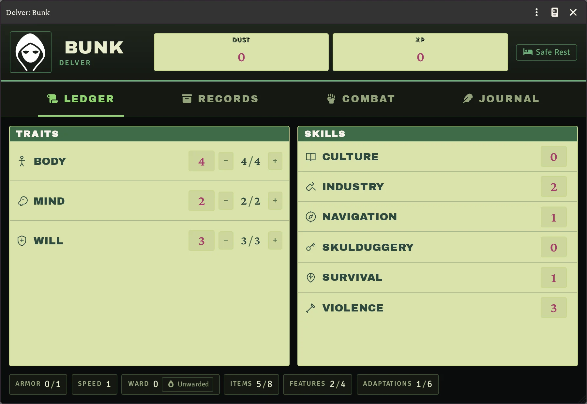
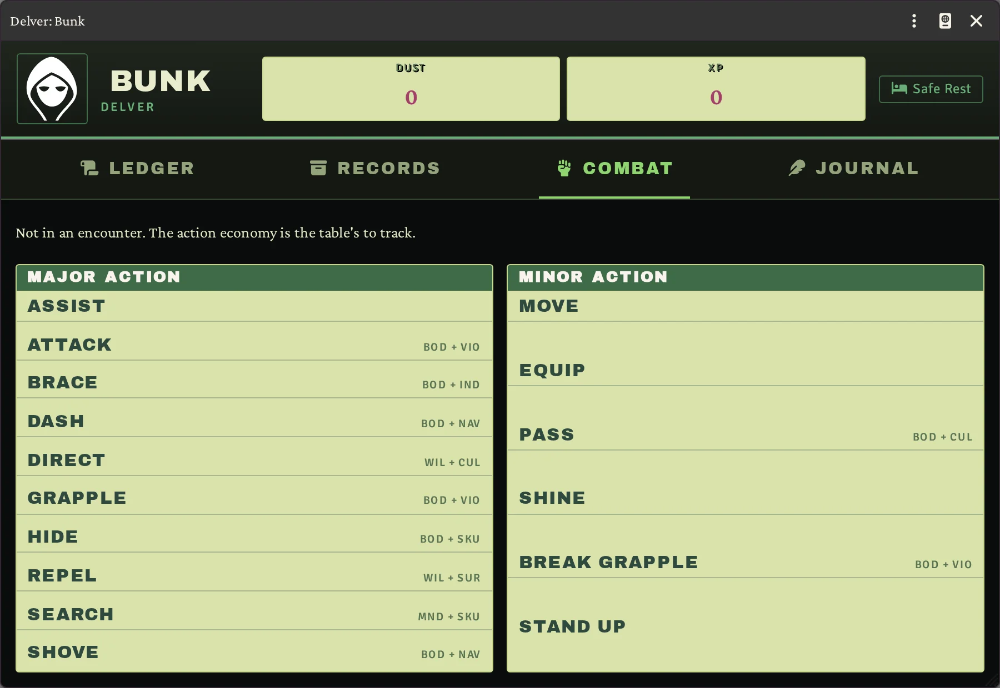
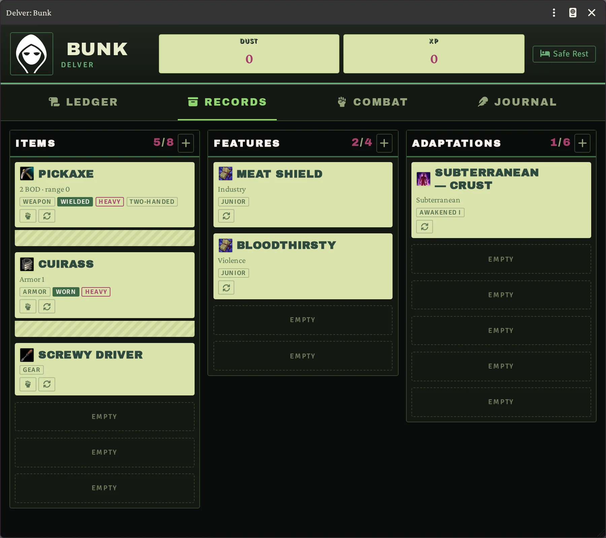
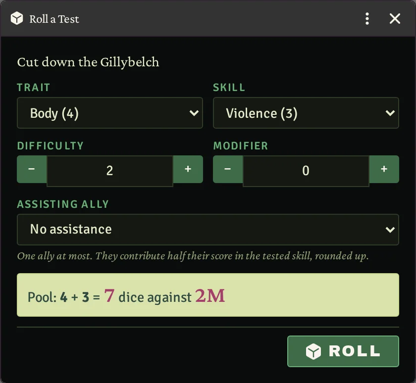
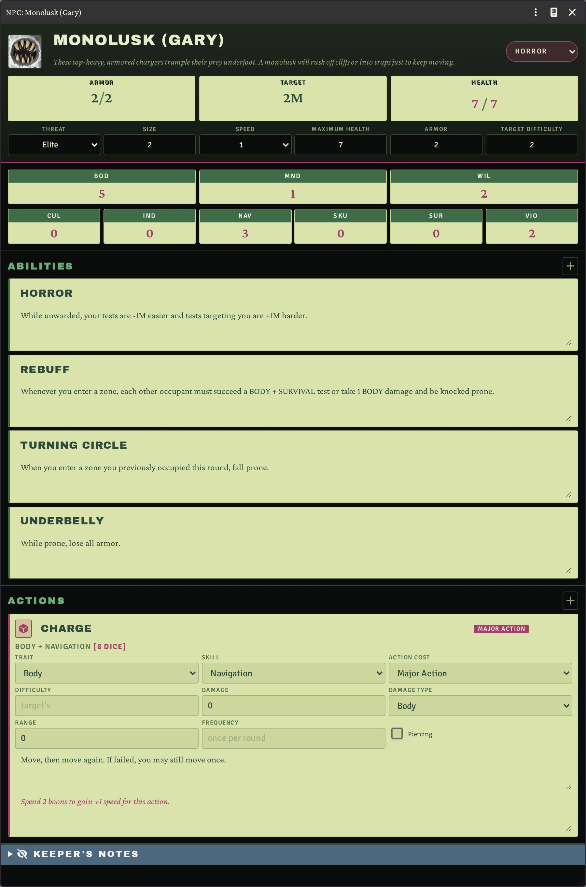
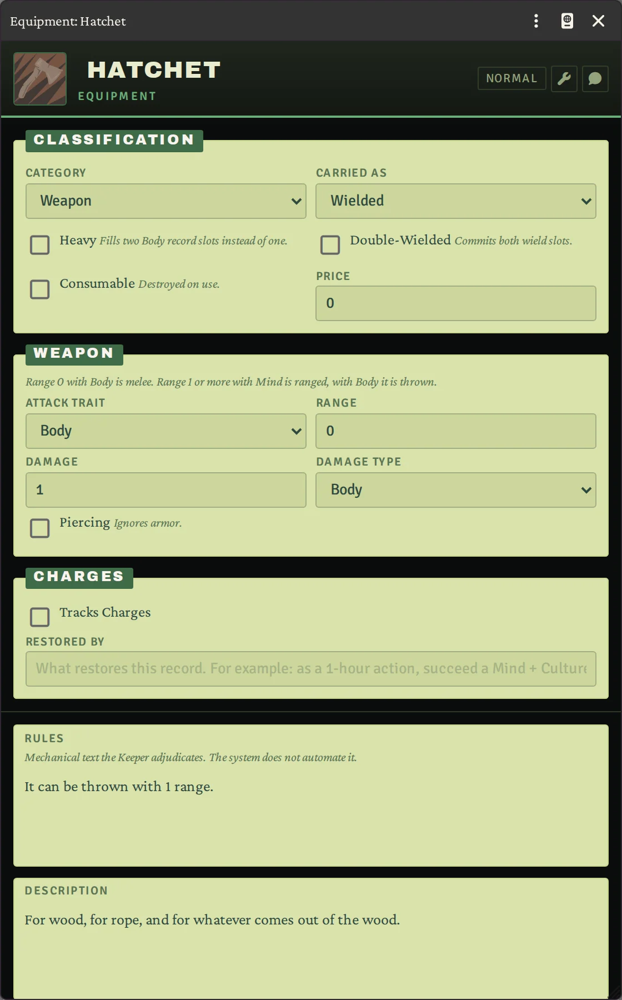
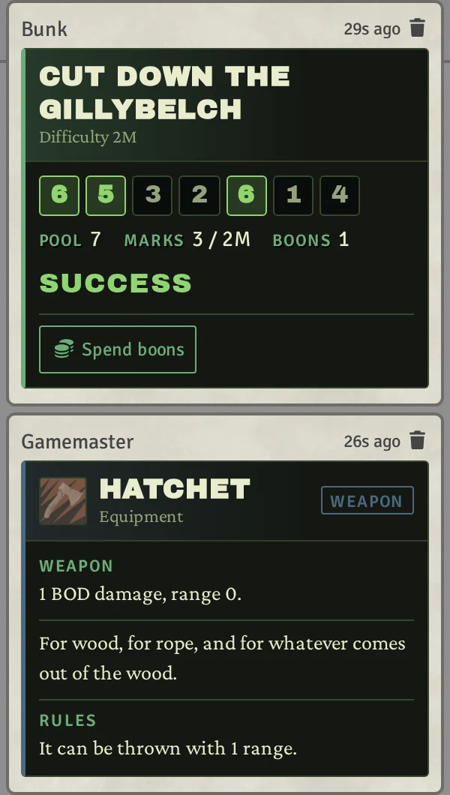

# Time Without Tide — Foundry VTT System

> **Unofficial fan project. Free, and never for sale.** *Time Without Tide* © 2026 Chaosium
> Studios LLC. All rights reserved. This system is not published, endorsed, or specifically
> approved by Chaosium Inc. See [Legal](#legal) before you use or fork this.

An unofficial [Foundry VTT](https://foundryvtt.com/) system for **Time Without Tide**, a Victorian
apocalypse tabletop RPG where the moon has shattered and an eldritch fog called the Unknown eats
the world. Delvers walk into the mist to keep the light burning.

This system implements the game's rules — the d6 mark pool, Strain, record slots, ward, zones and
travel — with character and NPC sheets, a chat-card dice engine, and compendiums of the printed
content.

## Screenshots

|  |  |
| :--: | :--: |
|  |  |
| **Ledger** — three traits, each with its own HP pool, and six skills. Armor, speed, ward and the slot counts sit along the bottom. | **Combat** — every major and minor action, each showing the trait and skill its test rolls. |
|  |  |
| **Records** — items, features and adaptations, in the slots their trait pays for. | **Tests** — choose trait, skill and difficulty; the dice pool is worked out before you roll. |

|  |  |  |
| :--: | :--: | :--: |
|  |  |  |
| **NPC statblock** — one pool of health, with abilities and actions. The Keeper's notes stay hidden from players. | **Equipment** — category, damage, range and the rules text the Keeper adjudicates. | **Chat** — the dice that rolled, marks against difficulty, and boons left to spend. |

## The game

*Time Without Tide* was created by David Naylor and James Coquillat and is published by Chaosium.
The Quickstart is available on DriveThruRPG:

**https://www.drivethrurpg.com/pt/product/581811/time-without-tide-quickstart**

The game is crowdfunding on BackerKit, and backing it is the best way to support the people who
made it:

**https://www.backerkit.com/c/projects/chaosium/time-without-tide-mirth-misery-in-a-world-of-fog**

You need the rules to play. This repository only provides the Foundry implementation and claims no
ownership of the game.

## Requirements

Foundry VTT **v14** or later. No modules are required.

## Install

In Foundry, open **Configuration and Setup → Game Systems → Install System**, paste the manifest
URL below into the *Manifest URL* field, and click **Install**:

```
https://github.com/brunocalado/twt/releases/latest/download/system.json
```

That URL always points at the newest release, so Foundry will offer updates as they are published.

To install by hand instead, download `twt.zip` from the
[latest release](https://github.com/brunocalado/twt/releases/latest) and unzip it into your Foundry
data folder at `Data/systems/twt`, so that `Data/systems/twt/system.json` exists. Restart Foundry
afterwards.

## Legal

This is an unofficial, fan-made implementation, written by a player and given away for free. It is
**not published, endorsed, or specifically approved by Chaosium Inc.**, and it carries no official
standing of any kind. Nothing here is for sale, and nothing here may be sold.

*Time Without Tide* © 2026 Chaosium Studios LLC. All rights reserved. The game was created by
David Naylor and James Coquillat. Chaosium Inc. and the Chaosium logo are registered trademarks of
Chaosium Inc. The setting, rules, names, characters and artwork are the property of their owners,
and naming the game here is descriptive use, not a claim of ownership, license, or of any
commercial relationship.

Chaosium's Fan Material Policy expressly does not cover software, apps or virtual tabletops, so
this project claims no permission under it. It exists because someone wanted to play the game in
Foundry, and it is published in good faith and without any claim of right.

You need your own copy of the rules. This repository is not a substitute for the book: it holds no
artwork, no maps, no handouts and none of the book's chapters. The compendiums carry the short
mechanical entries a virtual tabletop needs in order to run a roll.

**To any rights holder:** open an issue on this repository, or contact the repository owner, and
anything you object to will be removed promptly and without argument.

## License

GPL-3.0 covers the original code in this repository: the module, sheets, templates and stylesheets.
See [LICENSE](LICENSE). It does not, and cannot, extend to *Time Without Tide* itself, which
remains entirely with Chaosium Studios LLC.
